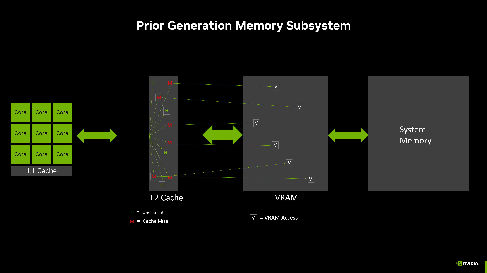

##### FlashAttention: Fast and Memory-Efficient Exact Attention with IO-Awareness 

基础知识补充：

GPU 中包括靠近 GPU 处理核心的高速缓存，用于存储可能需要的数据。如果 GPU 可以从缓存中调用数据，而不是从显存（更远）或系统内存（甚至更远）请求数据，则数据将被更快地访问和处理，从而提高性能和游戏流畅性，并降低功耗。

GeForce GPU 在每个多单元流处理器 （SM） 中都有一个 1 级 （L1） 缓存（最接近和最快的缓存），每个 GeForce RTX 40 系列图形处理集群 （GPC） 中最多可以找到 12 个缓存。其次是快速、更大的共享 2 级 （L2） 缓存，可以以最小的延迟快速访问。

访问每级缓存都会引入延迟，换来的是更大的缓存容量。

在使用过程中，GPU 首先在 SM 内部的 L1 数据缓存中查找数据，如果在 L1 中找到数据则无需访问 L2 数据缓存。如果在 L1 中未找到数据，则称为“缓存未命中”，并将继续进入 L2 缓存查找。如果在 L2 中找到数据，则称为 L2 “缓存命中”（请参见上图中的“H”标识），数据将提供给 L1，然后提供给处理核心。
如果在 L2 缓存中找不到数据（L2“缓存未命中”），GPU 现在会尝试从显存获取数据。您可以在上图中看到许多 L2 缓存未命中，该图描述了我们之前的架构存储子系统，这会导致许多显存访问。
如果数据在显存中未找到，GPU 会从您的系统内存中请求它。如果数据不在系统内存中，通常可以从 SSD 或硬盘驱动器等存储设备将其加载到系统内存中。然后将数据复制到显存、L2 缓存以及 L1 缓存，并最终馈送到处理核心。请注意，存在不同的基于硬件或软件的策略来将最有用和最常访问的数据保留在缓存中。
每一次通过显存层级结构的读写数据操作都会降低性能并消耗更多功率，因此通过提高缓存命中率，我们可以提高帧率和效率。

硬件知识完全小白的个人理解：

GPU的显存和CPU的内存是类似的，只是用来存储数据，实际的计算是GPU中的SM单元中的Cuda core或者Tensor Core等。

当开始执行指令计算时，首先访问L1 Cache查找数据，找不到就去L2 Cache找，然后是才是显存。

由于带宽的限制，越往后找越慢。这也是Flash Attention的优化点。

作者发现Attention计算的瓶颈在数据访问也就是带宽瓶颈，原始计算中数据查找应该是显存中才能找到，因为L1（也就是那个SRAM）太小根本放不下，因此之前也没有提前把数据放到L1中。再加上原始Attention有频繁的读写，导致速度特别慢。

作者将Attention进行分块计算，就可以将分块后满足L1缓存大小的数据块直接塞进L1 Cache，再加上online softmax的方式，减少频繁的读写，速度就有了大幅提升。

为什么原始过程中，L1直接装不下，但是在显存中找到后也是加载到L2再到L1才能计算，L1就能装下了？

应该是，如果数据比较大，加载到L1仍然是一块一块的加载，比如先加载部分Q和K，算完点积写回显存，然后再加载一部分Q和K，算完再写回，依次进行。等到所有的Q和K算完得到S矩阵后，再加载S到L1中去算softmax得到P，这样分步进行。即使seq_len太长，S太大也装不下，那可以把S沿着列方向切分，因为S是沿着行方向计算的，各行之间是独立的。

#### 

不写了，直接三位大佬的博客。不可能写的更好了。剩下也许就是翻译原论文了。

[1] https://blog.csdn.net/v_JULY_v/article/details/133619540

[2] http://fancyerii.github.io/2023/10/23/flashattention/

[3] https://mp.weixin.qq.com/s?__biz=MzI3ODgwODA2MA==&mid=2247525362&idx=1&sn=28474ea7317931d291b87bfb3e7f5995&chksm=eb537761dc24fe773248f7b85d9b56047317b7f2a70fda94f295e3bf146453739ab359071995&mpshare=1&scene=1&srcid=0222aM5LWOMjkUtqCpBqIqjJ&sharer_shareinfo=880039d3cabf84db9028433c53e7a887&sharer_shareinfo_first=880039d3cabf84db9028433c53e7a887&exportkey=n_ChQIAhIQik8WMs5vLuHdIsqt0PXoQhKYAgIE97dBBAEAAAAAAH3iDr933q0AAAAOpnltbLcz9gKNyK89dVj0OrK%2BEIgrlcA0BkannItOdRQDxRGNXLbc13nWBcWPeKnD2B8rMMAjS%2BShWyU6gCnYCqvkk3pOWcPby2PeE3ibNHpZfGlQFucPUR%2F6F3QrPpm0S1%2F%2F%2BRb7WD3xkL8mfRgWPgupiVno2oO6ewDJu%2B7kOg2LBT4%2FqlQaqPyOWYFprMJZe7NH0RMQwLVMv%2F37yv4Nu3FiIIZ8bTMxZUzMotV95GpbJ6qsiWVY3G2cHlXj0IN%2FRQp%2F5%2FlZU%2FPFv4P%2BsRxVbc4oceBKRxSsw5fQ1XQ8YSs1jUqG7AKgluXH3lpl6jAXgGbPZZqv7q0znfLX%2Fs8ZSs4%3D&acctmode=0&pass_ticket=4VTpNvG1thl3WZY%2BqZCQvaqG6EaFUtwZR3ONy%2FiZlo%2FKMff5c9GM83brEIpNrSnf56vW%2Bdic3LfK00Sl0ZVBNg%3D%3D&wx_header=0#rd

图解：

[3] https://zhuanlan.zhihu.com/p/626079753

https://mp.weixin.qq.com/s?__biz=MzA4MjY4NTk0NQ==&amp;mid=2247519461&amp;idx=1&amp;sn=292e647dd10734e3ae8bfc00b7f0e645&amp;chksm=9f833673a8f4bf653718401443fb09e71f349dafc59df43260f13b284465e927eaf5a504bc0f&amp;scene=21#wechat_redirect

带有内存访问复杂度分析

[4] https://readpaper.feishu.cn/docx/AC7JdtLrhoKpgxxSRM8cfUounsh

显存、缓存的基础知识补充

[5] https://www.nvidia.cn/geforce/news/rtx-40-series-vram-video-memory-explained/

