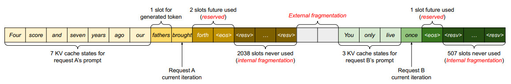

##### PagedAttention

### 导读

**1 现有系统存在内部和外部内存碎片的问题**

vLLM团队分析了推理时的内存浪费问题，认为推理中存在三种内存浪费

Reservation：由于不确定每个请求的输出长度，需要给每个请求预留max_seq_len的空间。
Internal Fragmentation：在Static Batching策略下，一个请求结束时，其剩余的空间就被浪费掉了。
External Fragmentation：由于KVCache是一个巨大的矩阵，且必须占用连续内存，操作系统如果只分配大的连续内存，势必有很多小的内存空间被浪费掉。

下图说明了两个请求：请求 A 的最大可能序列长度为 2048 个，请求 B 的最大可能序列长度为 512 个。现有系统中的块预分配方案有三个主要的内存浪费来源：为将来的令牌预留插槽、由于对潜在最大序列长度的过度配置而导致的内部碎片，以及来自内存分配器（如伙伴分配器）的外部碎片。外部碎片永远不会用于生成的令牌，这在提供请求之前是已知的。内部碎片也未使用，但这只有在请求完成采样后才能实现。

它们都是纯粹的内存浪费。尽管最终使用保留的内存，但在整个请求的持续时间内保留此空间（尤其是当保留空间很大时）会占用本来可用于处理其他请求的空间。我们在图 2 中可视化了实验中内存浪费的平均百分比，揭示了以前系统中的实际有效内存可以低至 20.4%。

vLLM团队认为，Continuous Batching可以部分解决Internal Fragmentation问题，但是Reservation和External Fragmentation的浪费仍然存在。因此他们提出了Paged Attention，其借鉴了操作系统中通过Page管理虚拟内存的思想：将KVCache分割为固定大小的Block，这些block不需要存储在连续内存中，由一个统一的内存分配器管理。请求按需申请内存，不需要预先留好max_seq_len大小的内存，解决了Reservation的浪费，请求结束后释放掉自己的blocks，解决了Internal Fragmentation，而系统只需要分配小的block，解决了External Fragmentation的问题。

**2 现有系统无法利用内存共享的机会**

LLM 服务通常会使用先进的解码算法，例如并行采样和波束搜索，这些方法可为每个请求生成多个输出。在这些场景中，由多个序列组成的请求可以部分共享它们的 KV 缓存。但是，现有系统不可能使用内存共享，因为不同序列的 KV 缓存存储在分开的相邻连续空间中。

为了解决上述限制，该团队提出了一种注意力算法 PagedAttention；该算法的灵感来自操作系统（OS）解决内存碎片化和内存共享的方案：使用分页机制的虚拟内存。

PagedAttention 会将请求的 KV 缓存分成一块块的，每一块（block）都包含一定数量 token 的注意力键和值。在 PagedAttention 中，KV 缓存的块不一定要存储在相邻连续空间中。

这样一来，就能以一种更为灵活的方式来管理 KV 缓存，就像是操作系统的虚拟内存：你可以将那些块看作是分页，将 token 看作是字节，将请求视为进程。通过使用相对较小的块并按需分配它们，这种设计可以减少内部碎片。

此外，它还能消除外部碎片，因为所有块的大小都相同。

最后，它还能实现以块为粒度的内存共享；这种内存共享支持与同一请求相关的不同序列，甚至也支持不同的请求。

vLLM团队的benchmark显示，使用PagedAttention可以将模型批量推理的吞吐量再提升3倍以上，达到Static Batching的6倍，而Paged Attention的另一个好处是不同的请求可以共享cache block，比如在beam search场景中，我们需要对同一个prompt生成多个结果，这些子请求就可以共享同一批prompt cache，PageAttention可以将beam search的吞吐量提升10倍以上。

并行解码时的应用

由于两个输出共享同一个 prompt，所以在 prompt 阶段只需为 prompt 的状态在内存空间中保留一个副本；这两个序列的 prompt 的逻辑块都会映射到同一个物理块。也就是Copy-on-write机制，只有出现不同的输出时才会拷贝一份。

用户可以通过官方的vLLM库使用Paged Attention，英伟达的TensorRT-LLM库和微软的Deepspeed-MII库也对部分模型提供了支持。

【参考】

[1] https://blog.csdn.net/javastart/article/details/136291419

[2] https://blog.csdn.net/muyao987/article/details/131690801

[3] https://cloud.tencent.com/developer/article/2332926

