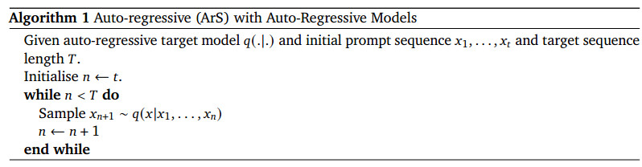
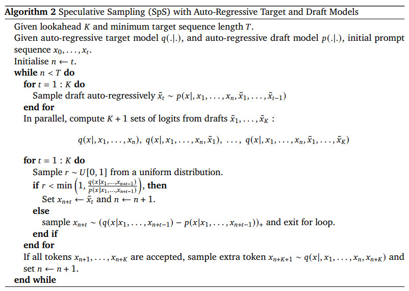
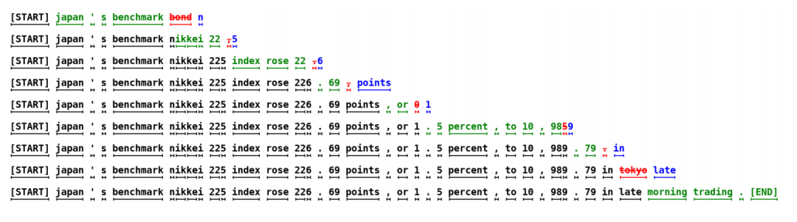

##### Accelerating Large Language Model Decoding with Speculative Sampling 

### 导读

### 1 引言

随着全球对大模型持续的高度关注，国外的OpenAI、Google以及国内的百度、阿里等都在大模型领域中不断地探索前进。由于模型的参数量和计算量的不断增大，大模型的推理部署成本也“水涨船高”，对模型推理的优化成为研究热点。

自回归类大语言模型的推理瓶颈均在于数据搬运过程，而并不受限于计算，因此整个问题为受内存限制的（memory-bound）。基于Transformer Decoder的大语言模型在推理时与训练过程不同，推理时我们并不能知道下一个字是什么，只能进行串行的预测，将预测到的下一个词连同之前的句子一起作为输入，继续预测下一个词，这样每生成一个token，都需要将所有参数从内存传输到缓存中。也就是说答案有几个字模型就要跑几次，而大模型的参数量巨大，这个过程受内存带宽(memory bound)的限制，这就是大模型推理的瓶颈。

当前业内一直在致力于研究大模型推理的优化技术。因此目前主流思路为减少数据在设备内存与寄存器中的搬运。当前已有的大语言模型推理提速的方式，包括低精度计算、模型量化、适配器微调、模型剪枝、批量推理、多GPU并行和其他推理优化工具等方法，这些方法中，有些需要对模型架构、训练过程等做出修改，模型的输出分布也会发生变化，有些会造成精度损失，比如量化、低精度计算等可以使整体数据搬运量大大降低，然而这很有可能会造成模型预测效果的减弱，毕竟许多模型权重的信息在量化的过程中会被丢失。这样另外一种目前主流的优化方法是使用多/组查询注意力方法（multi/grouped-query attention：MQA/GQA），用于减少KV cache的大小。尽管MQA/GQA增加了对大批次（batch size）吞吐量支持，然而对延迟的减少并没有太多，此外减少的KV cache也会一定程度上降低模型的预测效果。

可以看出减少数据搬运量都是有一定代价的，虽然可以提高推理效率，但是随之带来的很可能就是模型整体预测效果的减弱。那么既然底层硬件的计算力没有被利用满，不妨想办法把这些空闲的算力给利用上，也就是通过算力换取带宽的做法。

### 2 相关工作

深度学习领域中，如果训练数据足够，模型的预测效果会随着模型规模的增加而变得更准确。然而，庞大的模型会导致模型部署时的巨大开销 。因此，Hinton等学者在2015年提出了知识蒸馏（knowledge distillation）[2]的概念，利用规模庞大的教师模型来训练参数规模小的学生模型，通过蒸馏学习，实际部署的学生模型不仅开销较小，而且具有接近教师模型的预测效果。投机采样方法（speculative sampling）就是利用蒸馏学习中，小模型近似大模型的概念。该方法在保证模型输出质量的同时，充分优化了自回归大语言模型的推理速度。

投机采样的关键在于利用小模型多次推理单个字，让大模型进行多字预测，从而提升整体推理效率。每次小模型的单字推理耗时远远小于大模型，因此投机采样能够有效地提高推理效率。这种方法的优势在于，通过蒸馏学习和投机采样，可以在减小模型规模的同时，保持较高的预测效果和推理速度，从而在实际部署中获得更好的性能优化。

 投机采样的核心思想是许多常见的单词和句子都是非常容易被预测的，可以用更简单的模型来近似。因此，大模型只需要在关键部分中指导小模型，这样就能够带来性能提升。与传统的自回归推理方法不同，投机采样采用了一个草稿模型（draft model），通常是规模更小的模型，进行自回归推理。而原始的大模型则会根据小模型推理的结果进行评估，决定是否接受小模型推理出的结果。这样大模型只需要处理小模型无法处理的复杂部分，这个方法不需要修改大模型的结构，也不需要重新训练模型，降低推理成本的同时，实现推理提速。

标准的自回归采样算法如下，其实现过程是在while循环中，模型生成下一个元素，并将生成的元素添加到序列中，循环执行直到序列达到目标长度。

投机采样算法，实现过程如下：

在整个推理过程的while循环(多次投机采样)中：

步骤一：小模型进行自回归采样，生成小模型预测的初始输出序列X，X中每个输出都有个概率p；

步骤二：并行前向传播，将前缀和小模型生成的输出序列X拼接输入大模型进行前向传播，得到大模型的一系列输出和对应概率q；

步骤三：评估结果，如果p当前索引对应的q索引的概率为1，则接受当前的token，得到最终输出x；如果p当前索引对应的q索引的概率为0，则拒绝当前的字，并取q概率为1的字，得到最终输出x后退出循环和本次的投机采样；

步骤四：返回生成的结果，如果当次投机采样接受了所有初始输出X，则选择q最后一个序列位置概率为1的字，得到最终输出x。重复步骤1，直到结束循环。

其实核心就是，小模型先输入起始符，通过自回归连续预测几次，输出一串结果。然后大模型将开始符拼接这一串结果作为输入，并行推理，也输出一串结果。然后按顺序逐个比对二者的结果，如果一致就是认可小模型的输出，再比下一个。直到遇到二者输出不一致或者比完这一串输出都一致。如果遇到不一致的，就把大模型的输出作为正确的输出，后面就不再比对并退出本次采用。因为出现了不一致意味着小模型从此位置开始后面的输出都是错的（相对大模型），而这些输出都作为大模型的输入了，所以大模型后面对应的输出也就没有意义了。退出采样后，将之前得到的正确的一串输出作为输入，送入小模型中继续进行自回归生成一串结果，再将结果送入大模型并行推理，再比对结果，依次循环，直至大模型输出结束为止。如果比完都一致，那也是退出采样继续循环比对。

这里需要理解的是，自回归的工作原理。另外的核心就是大模型对小模型输出的评估，从前往后比对，一旦遇到不一致就停下了，不会出现小模型预测的不对，但是这些不对的预测都送入大模型，岂不是造成大模型输出的也很离谱了。那就没有意义了。

### 3 举例说明

接下来通过一个例子来解释投机采样的过程：

说明：图中的每一行都表示一次迭代，其中，绿色的tokens表示大模型接受小模型给出的结果，红色tokens表示被拒绝的小模型的结果，蓝色tokens表示对被拒绝的tokens进行修正后的结果，每个词或字母下面的下划线表示这是一个完整的token。

在第一次迭代中，小模型生成了五个tokens，分别为“japan”、“'”、“s”、“benchmark”、“bond”，将前缀和小模型生成的5个tokens一起作为输入，进行一次推理，可以看到，最后一个token“bond”被目标模型拒绝，并重新进行采样，生成token “n”；在第二次迭代中，目标模型接受了小模型生成了5个tokens，并拒绝了最后一个token，以此类推，在第九次迭代结束后，生成了完整的句子，共38个tokens。可以看出，投机采样的方式比只用大模型进行自回归采样进行推理要更加高效。

### 4 提速效果

#### 5.1 总结

当然，投机采样的推理方式并不适用于所有的应用场景，例如，文学艺术类的诗词等，大小模型生成的tokens差异可能较大，但对于代码生成类问题，投机采样就比较适合。投机采样的推理方式并不是完美的，主要考虑两个方面，首先是小模型的选择，要求与大模型接口统一、概率分布接近，其生成质量也不能比大模型差太多；另一方面就是相比单个模型的部署，两个模型的部署更加复杂。

关于如何更好地利用投机采样来优化大语言模型性能，我们需要考虑几点：

通常选择规模较小的同类模型作为小模型，例如LLaMA-7B作为小模型与LLaMA-65B大模型的组合可能是一个较好的选择。另外，经过低精度量化的原始大模型也可以作为小模型的候选者。

原文中建议选择合适的循环长度K=4，过高的K值反而会对性能产生负面影响。因为通常情况下，小模型输出被大模型接受的概率会随着字数增长而降低。因此，过高的K值会增加大模型的计算量。当然，越接近大模型的小模型，能容忍的K值就越高，但需要确保小模型的推理代价比大模型低。

重计算和KV cache的取舍 – 理论上小模型和大模型都可以储存KV cache。然而，小模型的输出并不一定都会被大模型所接受，因此不被接受的输出可能会引起大模型额外KV cache的存储代价。

总而言之，合适的投机采样循环长度以及小模型的选择是提升模型效率的关键。

虽然投机采样的方式有缺陷，但明显优点远大于缺点，它能够实现将大模型直接跑在终端桌面上，不再依赖服务器，大大降低成本预算，根据OpenAI泄露的消息，GPT-4可能也在使用投机采样进行推理加速，这对于成本的节约，无疑是更好的选择。

[1] https://zhuanlan.zhihu.com/p/666452391

[2] https://arxiv.org/pdf/2302.01318.pdf

[3] https://proceedings.mlr.press/v202/leviathan23a/leviathan23a.pdf

[4] 壁仞科技：https://www.birentech.com/Research_nstitute_details/24.html
[5*] https://blog.csdn.net/LF_AI/article/details/135399289

