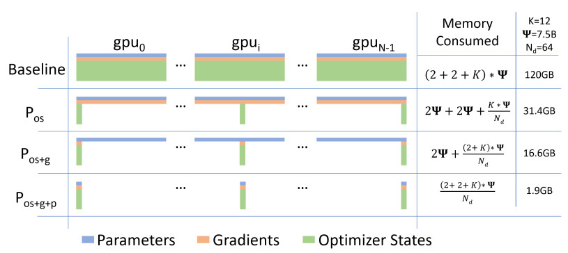
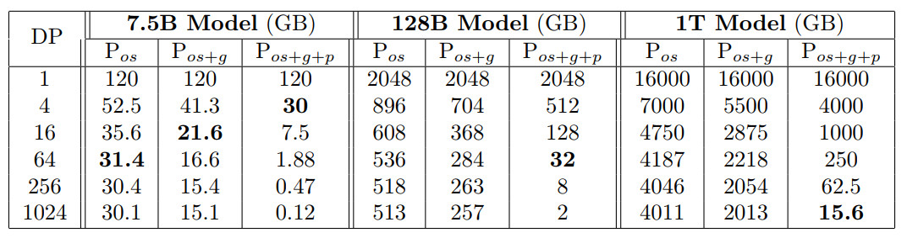

##### ZeRO: Memory Optimizations Toward Training Trillion Parameter Models 

### 导读

零冗余优化器，主要是对优化器状态、梯度和参数进行切分到多个并行显卡中，并且支持offload技术，从而实现节省显存的目的，可以训练更大的模型。

ZeRO是ZeRO-DP和ZeRO-R两种方法的组合。ZeRO-DP是一种增强数据并行机制，它使用动态通信策略来将优化器状态、梯度和参数进行分区，以最小化通信量和避免模型状态的冗余。ZeRO-R则使用分区激活重计算、恒定大小缓冲区和动态内存碎片整理机制来优化剩余状态的内存消耗。

### 摘要

大规模深度学习模型可以显著提高accuracy，但训练数十亿到数万亿的参数是一项挑战，因为单个GPU无法容纳如此大的存储模型和状态量。现有的解决方案比如跨GPU的数据和模型并行存在了很大局限性：这些方案虽然获得了计算、通信和开发效率，但都是在各种因素之间权衡，而且有一个最基本的问题：模型只能位于有限的设备内存中。

论文作者开发了一种新的解决方案，使用零冗余优化器（Zero）来优化内存，这样可以极大地提高了训练速度，同时增加了可以有效训练的模型大小。ZeRO在寻求数据并行和模型并行的一个适当中间点，其希望消除数据和模型并行训练中的内存冗余，同时保持了较低的通信量和较高的计算粒度，使我们能够以持续的高效率按设备数量比例调整模型大小。因此，ZeRO 可以获得数据并行性和模型并行性的优点。可以用同样内存来来运行更大的模型，可以使用数据并行方式来训练那些以前只能使用模型并行进行训练的模型。

### 1 引论

常见的数据并行性（DP）并不会减少每个设备的内存，而其他现有解决方案，如管道并行（PP）、模型并行（MP）、CPU卸载（CPU-Offloading）等这些都是在功能性、可用性以及内存和计算/通信效率之间进行权衡。在训练大型模型的各种现有解决方案中，MP可能是最有前途的，然而，MP无法扩展到更大的尺寸。MP 会把模型进行垂直分割，将每一层中的计算和参数划分到多个设备上，这需要在每一层之间进行大量通信。因此，它们在GPU间通信带宽较高的单个节点内工作良好，但在单个节点之外，效率会迅速下降，因此无法有效的扩展到单个节点之外。

那么，我们如何克服现有解决方案的局限性，更有效地训练大型模型呢？为了回答这个问题，我们首先分析了现有系统在模型训练方面的全部内存消耗，并将其分为两部分：

* 对于大型模型来说，大部分内存被模型状态占用，其中包括优化器状态（如Adam中的动量和方差）、梯度和参数。

* 剩余的内存被：激活、临时缓冲区和不可用的碎片占据，我们统称为剩余状态。

因此，我们开发了Zero Redundancy Optimizer，在获得高计算和通信效率的同时，可以优化这两个方面的内存效率。

#### 1.1 优化模型状态

模型状态通常在训练过程中消耗最大的内存量，但是现有的方法，如DP和MP并不能提供令人满意的解决方案。

DP具有良好的计算/通信效率，但内存效率较差，而MP的计算/通信效率较差。更具体地说，DP在所有数据并行进程中复制整个模型状态，导致冗余内存消耗；虽然MP对这些状态进行分区以获得较高的内存效率，但往往会导致过于细粒度的计算和昂贵的通信，从而降低了扩展效率。此外，这些方法静态地维护整个训练过程中所需的所有模型状态，尽管这些模型状态在训练过程中并非是始终需要的。

基于这些观察结果，我们开发了ZeRO-DP，ZeRO-DP在保持DP的计算/通信效率基础之上，同时实现了MP的内存效率。ZeRO-DP通过对模型状态进行分区而不是复制来消除数据并行进程中的内存状态冗余，这样每个GPU之上的内存消耗将会和数据并行度成反比，并通过在训练期间使用动态通信调度来保留同DP基本一致的计算粒度和通信量，这样可以保持计算/通信效率。

在模型训练期间，大部分内存被以下三种情况之一消耗：

* 激活

* OGP状态，即由优化器状态（O），参数梯度（G）和参数本身（P）组成的张量

* 临时缓冲区

可能有人会问为什么不考虑输入数据的内存消耗，其实，输入数据所占用的显存其实并不大，这是因为用户基本使用迭代器读取数据，这意味着数据并不是一次性全部读入显存，因此每次输入所占用的显存与整个网络参数相比其实是微不足道的。

ZeRO DP有三个主要的优化阶段（如下图1所示），它们对应于优化器状态、梯度和参数的分区。当逐步启用时：

1）优化器状态分区（Pos）：内存减少4倍，通信量与DP相同，此阶段也被称为 ZeRO-OS。

2）添加梯度分区（Pos+g）优化：内存减少8倍，通信量与DP相同；

3）添加参数分区（Pos+g+p）优化：内存减少与DP的并行度成线性关系。模型内存被平均分配到每个GPU之上，每个gpu上的内存消耗与数据并行度成反比，但是通信量只是适度增加。例如，跨64个GPU（Nd=64）拆分将产生64倍的内存缩减。通信量适度增加了50%。

内存消耗具体可以参见下图：

图1：ZeRO-DP优化的三个阶段之中每个设备内存消耗比较。ψ表示模型大小（参数数量），K表示优化器状态的内存乘数，Nd表示DP并行度，即Nd个GPU。在本例中，我们假设基于Adam优化器的混合精度训练，模型大小为ψ=7.5B，DP为Nd=64，K=12。

#### 1.2 优化残余状态内存

在使用 ZeRO-DP 优化模型状态对应的内存之后，残余内存（Residual State Memory）成为次要内存瓶颈，剩余内存包括：激活、临时缓冲区和不可用内存片段。我们开发了ZeRO-R来分别优化这三个因素所消耗的剩余内存。

* 对于激活（从前向传播结果之中存储，用来支持后向传播），我们注意到优化检查点会有帮助，但是对于大型模型不够用。因此，ZeRO-R通过在现有MP方案中识别和删除激活副本来优化激活内存。它还可以在适当的时候将激活卸载到CPU。

* ZeRO-R为临时缓冲区定义了适当的大小，以实现内存和计算效率的平衡。

* 我们观察到在训练中，由于不同张量生命周期的变化而会导致一些内存碎片。由于这些碎片的存在，会导致即便即使有足够的可用内存，也会因为缺少连续内存而使得内存分配失败。ZeRO-R根据张量的不同生命周期来主动管理内存，防止内存碎片。

ZeRO-DP和ZeRO-R结合在一起形成了一个强大的DL训练内存优化系统，我们统称为ZeRO。

#### 1.3 ZeRO和MP

因为ZeRO消除了DP中的内存效率不足，所以很自然地会问：我们还需要MP吗？什么时候需要？ZeRO如何与MP一起工作？

使用ZeRO之后，MP对于大型模型就不太有吸引力了。ZeRO-DP在减少每设备内存占用方面至少与MP一样有效，或者在MP无法均匀划分模型时更有效。它还具有相当或更好的缩放效率。此外，数据并行非常容易使用，因此它广泛适用于不同的工作负载，而如今的MP方法通常需要模型开发人员的一些额外工作来修改其模型，比如现有的工作（如Megatron-LM）只支持有限的操作和模型集。

尽管如此，仍然有一些情况下我们希望利用MP:

i）当与ZeRO-R一起使用时，MP可以减少大型模型的激活内存占用。

ii）对于激活内存不是问题的较小模型。当单独使用DP时，可能会因为聚合batch size太大而无法实现良好的收敛性，这时候MP也有好处。在这种情况下，可以将ZeRO与MP结合起来，使模型具有可接受的聚合batch size。

### 2 相关工作

#### 2.1 数据，模型和流水线并行

并行化是大型模型训练的关键策略。对于可以塞进设备内存的模型，数据并行（DP）用于将训练扩展到多个设备。在DP中，模型参数复制到每个设备上。在每个步骤中，一个小批量被均匀地分发到所有数据并行进程中，这样每个进程都会对不同的数据样本子集执行正向和反向传播，并使用进程间的平均梯度来局部更新模型。

当一个模型不适合设备内存时，模型并行性（MP）和流水线并行性（PP）分别以垂直和水平方式在进程之间分割模型。

PP在层之间水平拆分一个模型，在不同设备上运行不同的分区，并使用微批处理隐藏管道气泡。由于水平拆分和micro-batching，所以某些功能（如tied-weight和batch-normalization）难以实现。

流行的PP实现（如G-pipe）同时对模型参数和总激活进行分区，但需要与管道分区数量成比例的batch size来隐藏管道气泡。大batch size可能会影响收敛速度，PP同时也需要大量内存来存储激活。

PipeDream是PP的另一种实现，其保留了过时参数的多个副本，以隐藏管道气泡，而不会显著增加batch size，从而可以降低内存效率。此外，该实现不等同于标准DL训练，并且对训练收敛有影响。

相比之下，ZeRO获得了与PP相同或更好的内存效率，而不会有PP带来的功能、性能和与收敛的限制。

#### 2.2 非并行方面的工作

原小标题为Non-parallelism based approach to reduce memory。

除了MP和PP之外，还有很多旨在减少DL训练内存开销的工作。

##### 2.2.1 减少激活内存

目前，有很多工作集中在减少激活的内存占用上，包括压缩、激活检查点或实时分析。这些努力是互补的，可以与ZeRO一起工作。事实上，ZeRO-R中的激活内存减少完全可以和激活检查点并行工作。

##### 2.2.2 CPU Offload

也有一些工作利用计算节点的异构性，分别通过算法设计或虚拟化内存将模型状态转移到CPU内存。但是这导致有50%的时间被浪费在GPU-CPU-GPU传输。ZeRO的不同之处在于，它显著降低了内存消耗，而无需将模型状态存储到CPU内存中。在极少数情况下，ZeRO-R可能只针对非常大的模型才卸载激活检查点，以提高性能。

##### 2.2.3 内存高效(Efficient)优化器

另一些工作是通过获取模型参数和梯度的粗粒度统计数据来减少自适应优化方法的内存消耗，这可能会对模型收敛保证产生影响。ZeRO与这些工作是正交的，它的优化不会改变模型优化方法或影响模型收敛，但会有效地减少每个设备的优化器状态和梯度的内存占用。

#### 2.3 训练优化器

对于大型模型，自适应优化（Adaptive）方法对于达到SOTA性能和精度至关重要。与SGD相比，它以显著的内存占用为代价，维护每个模型参数和梯度的细粒度一阶和二阶统计信息。ZeRO可以将这些优化器的内存占用减少几个数量级，使这些复杂的优化方法对于在具有适度设备内存的硬件上训练大型模型非常实用。它还让人们可以开发和使用更复杂、内存消耗更大、收敛性更好的优化器。

### 3 模型内存都去哪里了?

让我们退一步来研究一下当前训练系统的内存消耗。例如，一个1.5B参数的GPT-2模型需要3GB内存用于16位精度的权重（或参数），但是人们却不能使用Tensorflow或PyTorch在一个32GB内存的GPU上进行训练。人们可能想知道所有的内存都去了哪里。在模型训练期间，大部分内存被模型状态消耗，即由optimizer状态、梯度和参数组成的张量。除了这些模型状态，其余的内存被激活、临时缓冲区和碎片化内存消耗，我们称之为剩余状态。我们将从这两个方面详细研究内存消耗。

#### 3.1模型状态：优化器状态，梯度和参数

原小标题为：Model States: Optimizer States, Gradients and Parameters

大多数设备内存在训练期间由模型状态消耗。例如，用Adam，DL训练中最流行的优化器之一作为例子。Adam需要存储两个优化器状态，i）时间平均动量（time averaged momentum）和ii）梯度方差（variance of the gradients）来计算更新。因此，要使用ADAM训练模型，必须有足够的内存来保存梯度动量和方差的副本。此外，也需要有足够的内存来存储梯度和权重本身。在这三种类型的参数相关张量中，优化器状态通常消耗最多的内存，特别是在应用混合精度训练时。

##### 3.1.1 混合精度训练

在当前一代NVIDIA GPU上训练大型模型的最先进方法是通过混合精度（fp16/32）训练，在这个方法中，参数和激活存储为fp16，从而能够在这些GPU上使用高吞吐的张量核心单元。在混合精度训练期间，优化器使用fp16权重和激活执行正向和反向传播。但是，为了在反向传播结束时有效地计算和应用权重更新，混合精度优化器必须保留参数的fp32副本以及所有其他优化器状态的fp32副本。

让我们以Adam优化器为例。使用Adam对带有ψ个参数的模型进行混合精度训练需要足够的内存来保存参数和梯度的fp16副本。其内存需求分别为2ψ和2ψ字节。此外，它还需要保存优化器状态，参数动量和方差的fp32副本，其内存需求分别为4ψ，4ψ和4ψ字节。

让我们使用K来表示优化器状态的内存乘数（multiplier），即存储它们所需的额外内存是Kψ字节。混合精度Adam的K=12。总的来说，这将产生2ψ+2ψ+Kψ=16ψ字节的内存需求。对于具有15亿个参数的GPT-2这样的模型，这至少需要24GB的内存，远远高于单独保存fp16参数所需的3GB内存。

#### 3.2 剩余内存占用

原标题为 Residual Memory Consumption

##### 3.2.1 激活

在训练期间，激活会占用大量的内存。作为一个具体的例子，1.5B参数的GPT-2模型以1K的序列长度和32的batch size 进行训练，需要大约60GB的内存。激活检查点（或激活重新计算）是一种常用的方法，可将激活内存减少到总激活的平方根，但需花费33%的重新计算开销。这将使此模型的激活内存消耗减少到约 8 GB。

尽管有显著的减少，但对于更大的模型，即便使用激活检查点，激活内存也会变得相当大。例如，一个具有1000亿个参数的类GPT模型，对于32大小的batch size，则需要大约60 GB的内存，即使使用激活检查点也是如此。

##### 3.2.2 临时缓冲区

对于大型模型，用于存储中间结果的临时缓冲区会消耗大量内存。有些操作，比如gradient all-reduce或者 gradient norm computation 会倾向于将所有梯度融合到单个平坦缓冲区中，以此来运行一个统一操作，这样可以提高吞吐量。例如，所有设备的带宽都会随着消息的增大而降低。虽然梯度本身通常存储为fp16张量，但融合缓冲区可以是fp32张量（具体取决于操作类型）。当模型较大时，这些临时缓冲区大小是非常重要的。例如，对于参数为1.5B的模型，扁平fp32缓冲区需要6GB内存。

##### 3.2.3 内存碎片

到目前为止，我们已经讨论了训练期间的实际内存消耗。此外，即使有足够的可用内存，也可能耗尽可用内存。内存碎片就可能导致这种情况。如果没有足够的连续内存来满足对内存的请求，即使总可用内存大于请求的内存，对内存的请求也会失败。在训练非常大的模型时，我们观察到明显的内存碎片，这会导致内存不足问题，在某些极端情况下，即使超过30%的内存仍然可用，依然无法分配内存。

### 4 ZeRO: 感悟和概述

ZeRO有两组优化：i）ZeRO DP旨在减少模型状态的内存占用，ii）ZeRO-R旨在减少剩余内存消耗。

#### 4.1 感悟和概述: ZeRO-DP

ZeRO powered DP 基于三个关键感悟：

DP比MP具有更好的扩展效率，因为MP降低了计算粒度，同时也增加了通信开销。超过某一点后，较低的计算粒度会降低每个GPU的效率，而增加的通信开销会隐藏跨GPU的可伸缩性，特别是在跨越节点边界时。相反，DP具有更高的计算粒度和更低的通信量，从而带来更高的效率。

DP内存效率低下，因为模型状态在所有数据并行进程中冗余存储。相反，MP对模型状态进行分区以获得内存效率。

DP和MP都保留了整个训练过程中所需的模型所有状态，但并非所有情况都需要。例如，每个层的参数仅在层的正向传播和反向传播期间需要。

基于这些感悟，ZeRO DP 在保留DP的训练效率的同时，也实现了MP的内存效率。ZeRO DP对模型状态进行分区，而不是复制它们，并使用动态通信计划，该计划利用模型状态固有的时间特性，同时最小化通信量。通过这样做，ZeRO-DP随着DP度的增加线性地减少了模型的每设备内存占用，同时保持通信量接近默认DP，这样就保持了效率。

#### 4.2 感悟和概述: ZeRO-R

##### 4.2.1 降低激活内存

两个关键感悟是：

MP对模型状态进行分区，但通常需要复制激活内存。例如，如果我们垂直分割一个线性层的参数并跨两个GPU并行计算它们，那么每个GPU都需要整个激活来计算其分区。

对于GPT-2或更大的模型，算术强度（每次迭代的计算量与每次迭代的激活检查点量之比）非常大(≥ 10K），并随着隐藏维度增加而线性增加，从而可以隐藏激活检查点的数据移动成本，即使在带宽较低的情况下也是如此。

ZeRO通过跨GPU划分激活检查点来消除MP中的内存冗余，并使用allgather按需重建它们。激活内存的减少与MP程度成比例。对于非常大的模型，ZeRO甚至可以选择将激活分区移动到CPU内存中，同时由于这些模型中的运算强度很大，因此仍然可以实现良好的效率。

##### 4.2.2 管理临时缓冲区

ZeRO-R使用恒定大小的缓冲区来避免临时缓冲区随着模型大小的增加而崩溃，同时使它们足够大以保持效率。

##### 4.2.3 管理内存碎片

内存碎片是短生命周期内存对象和长生命周期内存对象交错分配的结果。在正向传播期间，激活检查点的寿命很长，但重新计算的激活寿命很短。同样，在反向计算中，激活梯度的寿命很短，而参数梯度的寿命很长。基于这一认识，ZeRO通过将激活检查点和梯度移动到预先分配的连续内存缓冲区来执行动态内存碎片整理。这不仅提高了内存可用性，还通过减少内存分配器查找可用连续内存所需的时间来提高效率。

### 5 深入了解 ZeRO-DP

虽然现有的DP方法在每个设备上复制模型状态并引入显著的内存开销，但ZeRO DP通过跨数据并行的进程对它们（优化器状态、梯度和参数）进行分区来消除这种内存冗余。图1量化并可视化了有无ZeRO-DP的内存需求。该图显示了（1）优化器状态（2）梯度和（3）参数累积冗余 这三种参数在分区后的内存占用。我们将其称为ZeRO DP的三个优化阶段：Pos、Pg和Pp，我们将在下面详细说明。这里把图一再次贴出来。

#### 5.1 Pos : 优化器状态分区

对于一个Nd并行度的DP来说，我们将优化器状态分组到Nd个相等的分区中，这样第i个数据并行进程只更新与第i个分区对应的优化器状态。因此，每个数据并行过程只需要存储和更新总优化器状态 的$ \frac{1}{N_d}
，
然
后
只
更
新
 \frac{1}{N_d}$个参数。在每个训练步骤结束时，我们会执行一个跨数据并行进程的all-gather操作，以获得跨所有数据并行进程的完全更新的参数。

如图1所示的具体示例，7.5 B参数模型，使用64路DP（Nd=64），其Pos需要31.4GB内存。而使用标准DP则需要120 GB内存。此外，当Nd较大时，模型状态的内存需求从4ψ+12ψ=16ψ字节减少到4ψ+12ψ/Nd字节≈ 4ψ字节，导致4x倍数的减少。

#### 5.2 Pg: 梯度分区

由于每个数据并行进程只负责更新其相应的参数分区，因此，每个节点仅仅对自己负责的那部分参数的梯度进行规约。在归并之后，每个节点只需要自己参数分区对应的梯度，对于其他的梯度不再需要，所以它们的内存可以被释放。这将梯度的内存占用从2ψ字节缩减到 2ψNd。

实际上，这是一种 Reduce-Scatter操作，不同参数的梯度被减少到不同的进程之中。为了提高效率，我们使用了bucketization策略，其中我们将对应于特定分区的所有梯度bucketization，并立即对整个bucket执行规约。在我们的例子中，我们在分区边界执行一个reduce而不是 all-reduce，以减少内存占用，并重叠计算和通信。

内存节省：通过消除梯度和优化器状态冗余，我们将内存占用进一步降低到2ψ+ 14ψNd≈ 2Ψ. 如图1中的示例所示，7.5 B参数模型使用Pos+g和64路DP（Nd=64）时只需要16.6 GB内存，而使用标准DP时需要120 GB内存。当
Nd较大时，模型状态的内存需求从2ψ+14ψ=16ψ字节减少到2ψ+14ψ/Nd字节≈ 2ψ字节，减少8倍。

#### 5.3 Pp: 参数分区

就像优化器状态和梯度一样，每个进程只存储与其分区对应的参数。当正向和反向传播需要其分区外的参数时，会通过broadcast操作从适当的数据并行进程接收这些参数。虽然乍一看，这可能会导致显著的通信开销，但我们发现，这种方法只会将基线DP系统的总通信量增加到1.5倍，同时实现与Nd成比例的内存减少。

内存节省：通过参数分区，我们将ψ个参数的内存占用从16ψ降低到 16ψNd。 如图1中的示例所示，7.5 B参数模型使用Pos+g+p和64路DP（Nd=64）时只需要1.9 GB内存，而使用标准DP时需要120 GB内存。

这有着深刻的含义：只要有足够数量的设备来共享模型状态，ZeRO-DP就可以适合任意大小的模型。

#### 5.4 对模型大小的影响

分区Pos、Pos+g和Pos+g+p的三个阶段分别将模型状态下每个数据并行进程的内存消耗减少了4倍、8倍和Nd倍。表1分析了几个示例模型在不同DP程度下，ZeRO-DP 3个阶段下的模型状态内存消耗。

如果不使用ZeRO，则无论DP程度如何，内存消耗都等于表中的第一行。注意，当Nd=64时，ZeRO可以分别使用Pos、Pos+g和Pos+g+p来训练参数高达7.5B、14B和128B的模型。当Nd=1024时，启用所有优化的ZeRO（Pos+g+p）可以训练具有1万亿个参数的模型！或者可能是任意大小的模型！如果没有ZeRO，DP可以运行的最大模型的参数才不到15亿个。

### 6 深入 ZeRO-R

#### 6.1 Pa: 将 Activation Checkpointing 分区

正如前面所讨论，MP 在设计上就要求复制激活，从而在模型并行GPU之间产生激活的冗余副本。ZeRO通过对激活进行分区来消除这种冗余，并且在激活用于计算之前，才只以一个激活层的副本形式将它们一次性具化。

更具体地说，一旦计算了模型中一个层的前向传播，输入激活将在所有模型并行过程中进行分区，直到在反向传播中再次需要它。此时，ZeRO使用all gather操作重新具化激活的复制副本。我们将此优化称为Pa。它与激活检查点一起工作，只存储分区的激活检查点，而不是复制副本。此外，在非常大的模型和非常有限的设备内存的情况下，这些分区的激活检查点也可以卸载到CPU上，以额外的通信成本将激活内存开销降低到几乎为零，我们称之为Pa+cpu。

通过分区激活检查点，ZeRO将激活占用空间减少了一个与MP程度成比例的因子。考虑训练一个100B模型，其批大小为32，序列长度为1024，MP的度数为16。如果我们为每个转换器层检查一个激活，那么仅存储激活检查点就需要每个GPU大约33 GB的内存。但如果Pa为零，则每个GPU的容量可以减少到2GB左右。此外，这个2GB可以卸载到CPU上，从而将激活的内存占用减少到几乎为零。

#### 6.2 CB: 固定大小缓冲区

ZeRO仔细选择临时数据缓冲区的大小，以平衡内存和计算效率。在训练期间，某些操作的计算效率可能高度依赖于输入大小，输入越大，效率越高。例如，一个大的all-reduce操作比一个小的操作获得更高的带宽。因此，为了获得更好的效率，高性能库（如NVIDIA Apex或Megatron）在应用这些操作之前将所有参数融合到单个缓冲区中。然而，融合缓冲器的内存开销与模型大小成正比。例如，对于3B参数模型，32位融合缓冲区将需要12GB内存。为了解决这个问题，当模型变得太大时，我们只需使用一个高性能的固定大小融合缓冲区（Constant Size Buffers）。通过这样做，缓冲区大小不依赖于模型大小，并且通过保持足够大的缓冲区大小，我们仍然可以实现良好的效率。

#### 6.3 MD: 内存碎片整理

模型训练中的内存碎片是激活检查点和梯度计算的结果。在带有激活检查点的前向传播期间，只有选定的激活被存储用于反向传播，而大多数激活被丢弃，因为它们可以在反向传播期间重新计算。这将创建短期内存（丢弃的激活）和长期内存（检查点的激活）的交错，导致内存碎片。类似地，在反向传播期间，参数梯度是长生命周期的，而激活梯度和计算参数梯度所需的任何其他缓冲区是短生命周期的。同样，这种短期内存和长期内存的交错也会导致记忆碎片。

当有足够的内存可用时，有限内存碎片通常不是问题，但对于使用有限内存运行的大型模型训练，内存碎片会导致两个问题，i）由于缺乏连续内存，即使有足够的可用内存也会导致OOM，ii）由于内存分配器花费大量时间搜索连续内存块以满足内存请求，导致效率低下。

ZeRO通过为激活检查点和渐变预先分配连续内存块，并在生成时将它们复制到预先分配的内存中，动态地进行内存碎片整理。MD不仅使ZeRO能够以更大的批量训练更大的模型，而且还可以在内存有限的情况下提高训练效率。

### 7 ZeRO-DP 通信量分析

由于ZeRO通过消除内存冗余提高了可以训练模型的大小，所以很自然地会有疑问，是否在用通信量换取内存效率的问题。换句话说，与基线DP方法相比，ZeRO-powered到DP方法的通信量是多少？答案分为两个部分：i）ZeRO-DP使用Pos和Pg的时候并不会产生额外的通信，而可实现8倍的内存缩减；ii）ZeRO-DP在使用Pos和Pg之外的Pp时，最多会产生1.5倍的通信，但同时进一步将内存占用减少了Nd倍。

#### 7.1 数据并行通信量

数据并行训练期间，在反向传播结束，而在计算下一步的更新之前，会对所有数据并行进程的梯度进行平均。平均操作是使用all-reduce来完成的。对于大型模型，all- reduce通信完全受通信带宽的限制，因此，我们的分析仅限于每个数据并行进程之间发送和发送的总通信量。

all-reduce的最新实现一般采用两步方法，第一步是reduce-scatter操作，它规约了不同进程上数据的不同部分。下一步是all gather操作，其中每个进程收集所有进程上规约的数据。这两个步骤的结果就是一个all-reduce操作。“reduce-scatter”和“all-gather”都是使用流水线方法实现的，这会导致总共ψ个元素（假设数据包含ψ个元素）的数据移动。因此，标准DP在每个训练步骤中产生2ψ个数据移动。

#### 7.2 ZeRO-DP 通信量

##### 7.2.1 使用 Pos+g 的通信量

使用梯度分区之后，每个进程只存储梯度的一部分，这是更新其相应的参数分区所必需的。因此，与all-reduce不同，ZeRO只需要在梯度上进行scatter-reduce操作，从而产生ψ的通信量。在每个进程更新其负责的参数的分区后，将执行all-gather以从所有数据并行进程收集所有更新的参数。这也导致通信量为ψ。因此，每个训练步骤的总通信量为ψ+ψ=2ψ，与基线DP完全相同。

##### 7.2.2 使用 Pos+g+p 的通信量

在参数分区之后，每个数据并行进程只存储它负责更新的参数。因此，在前向传播期间，它需要接收所有其他分区的参数。但是，这可以通过流水线来避免内存开销。在计算与特定分区对应的模型部分的前向传播之前，负责该分区的数据并行进程可以将权重广播给所有数据并行进程。一旦该分区的前向传播完成，就可以丢弃这些参数。因此，总通信量为ψ×Nd/Nd=ψ。换言之，我们依靠在整个正向传播中传播来重新安排参数的all-gather，并在使用参数后丢弃这些参数。但是请注意，对于反向传播，需要再次进行此all-gather（但是以相反的顺序）。

因此，总通信量是reduce-scatter和 all-gather所产生的通信量的总和，总体积为3ψ，是基线的1.5倍。梯度和参数分区都利用了这样一种洞察，即并非所有的梯度和参数状态都是始终需要的，而是通过明智地传递状态来优化内存。

### 8 ZeRO-R 通信分析

我们将ZeRO-R中的分区激活检查点（Pa）的通信量与基线MP进行了比较，结果表明，Pa引起的通信量增加通常不到基线MP的十分之一。此外，我们分析了Pa的通信开销与DP通信量的关系，以确定Pa通过允许更大的批量和减少DP通信来提高效率的情况。我们利用这种分析来决定是否以及何时应用Pa以及Pa+cpu。

分区激活检查点的通信量权衡取决于模型大小、检查点策略和MP策略。为了分享具体的见解，我们在使用SOTA MP方法（Megatron-LM）实现的模型背景下进行分析。

在带有激活检查点的Megatron-LM中，每个transformer在正向传播中执行两个大小为batch×seq_length×hidden _dim 的all-reduce操作，两个all-reduce操作用于正向重新计算，另外两个all-reduce操作用于反向传播。每个块的总通信量为 12 × seq length × hidden dim，因为all reduce的通信量为2 × message size。

当ZeRO-R对激活检查点进行分区时，需要在每个激活检查点上向前重新计算反向传播之前执行额外的all gather操作。通常，我们检查每个transformer块的输入激活，每个转换器块需要一个all gather。因此，通信开销Pa为seq length ∗ hidden dim，因为所有聚集的通信量为message size。因此，Pa的总通信开销小于模型并行原始通信量的10%。

当MP与DP结合使用时，Pa可用于将数据并行通信量减少一个数量级，而模型并行通信量增加10%，并在数据并行通信成为性能瓶颈时显著提高效率。请注意，Pa将激活内存消耗降低了MP并行度，从而允许按比例增加批处理大小。对于大型模型，MP可以大到16个（DGX-2节点上的#GPU），允许批量大小最多增加16倍。数据并行训练的通信量与批量大小成反比。因此，由于Pa导致批量大小增加一个数量级可能导致数据并行通信量减少一个数量级。

最后，如果采用Pa+cpu，分区激活检查点将卸载到cpu，激活内存需求将减少到几乎为零，与Pa相比，cpu内存之间增加了2倍的数据移动。在极端情况下，DP通信量是主要瓶颈，因为即使使用Pa，批大小也很小，只要cpu数据传输开销小于DP通信量开销，Pa+cpu就可以通过增加批处理大小来提高效率，这通常适用于小批处理大小。

在给定模型和硬件特性的情况下，我们利用上述分析来决定是否以及何时应用Pa和Pa+cpu。

[1] https://www.cnblogs.com/rossiXYZ/p/15785669.html

[2]  DeepSpeed: Extreme-scale model training for everyone

https://www.microsoft.com/en-us/research/blog/deepspeed-extreme-scale-model-training-for-everyone/

[3] https://zhuanlan.zhihu.com/p/343570325

[4] https://zhuanlan.zhihu.com/p/116484241

